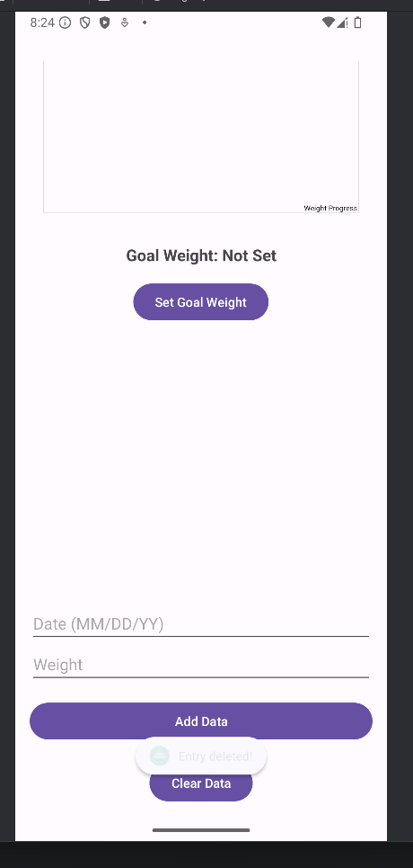
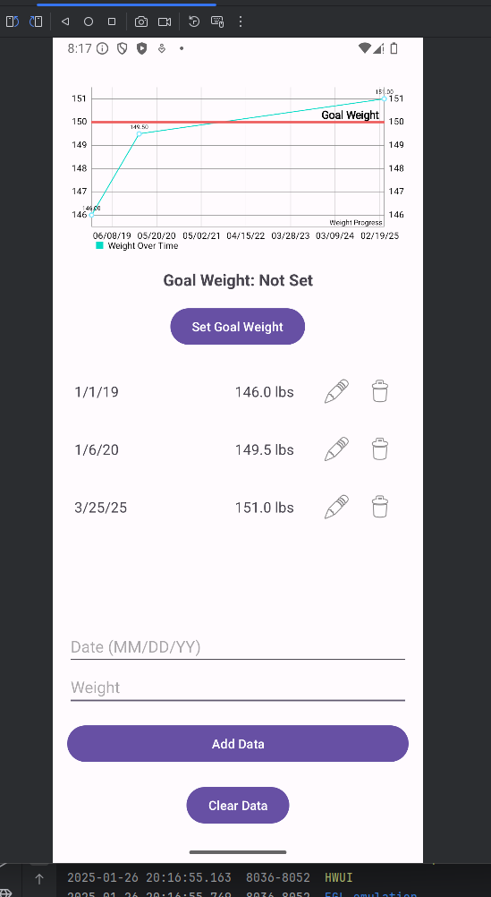

# Nuoro Weight Management App

## Overview

The **Nuoro Weight Management App** is a mobile application developed to assist users in tracking their weight over time, setting personal weight goals, and staying motivated through SMS notifications. Originally developed as part of the **CS-360: Mobile Architect & Programming** course, the app reflects key software design and engineering principles and serves as a user-centric tool for weight management.

This repository documents the enhancements made to the app as part of **Enhancement One** for the **CS-499: Computer Science Capstone**. The enhancements align with course outcomes, demonstrating innovative software engineering practices and addressing areas for improvement identified during the code review process.

---

## Features

### **Original State**

1. **Login Screen**:
   - Users can create an account and log in with a username and password.
   - No input validation or user feedback for login errors.

2. **Main Dashboard**:
   - Displays logged weight data as plain text in a static `TextView`.
   - Allows users to set a goal weight, add weight entries, or clear all data.
   - Minimal interactivity and feedback for user actions.

3. **Set Goal Weight**:
   - Enables users to input and save a personal weight goal.
   - Lacked validation for realistic goal weights.

4. **SMS Notifications**:
   - Users could grant permissions for SMS notifications, but the feature was broken.

5. **Database Integration**:
   - Stored user data, including weight entries and goal weight, in an SQLite database.
   - Limited functionality for managing individual records (e.g., no edit or delete).

### **Enhancements (Enhancement One)**

The following enhancements were implemented to improve usability, interactivity, and security:

1. **Input Validation**:
   - Added validation for usernames, passwords, dates, and weights.
   - Ensured dates follow the `MM/DD/YY` format and weights are within a realistic range.
   - Prevented invalid or empty data entries.

2. **Interactive Data Management**:
   - Replaced the static `TextView` with a dynamic `RecyclerView`.
   - Added **edit** and **delete** functionality with intuitive icons for each entry.
   - Enhanced user control over their data.

3. **Data Visualization**:
   - Integrated **MPAndroidChart** for visualizing weight trends.
   - Displayed weight progress over time with a goal weight marker in the chart.

4. **Improved SMS Permission Handling**:
   - Fixed the SMS permissions feature, ensuring proper request and confirmation dialogs.
   - Enhanced security and user trust by adhering to Android's permission model.

5. **User Feedback**:
   - Added detailed feedback messages for user actions (e.g., success messages for account creation, error dialogs for invalid inputs).
   - Incorporated confirmation dialogs for critical actions like deleting entries or clearing all data.

6. **Database Enhancements**:
   - Refactored database operations to support the new edit and delete functionalities.
   - Improved error handling and ensured synchronization between the UI and database updates.

7. **Goal Weight Management**:
   - Added validation for goal weights to ensure realistic values.
   - Displayed the goal weight on the chart with a red marker line for easy reference.

---

## Screenshots

### **Login Screen**

### **SMS Permission Request**

### **Account Creation Confirmation**

### **Initial Data Display**

### **Main Dashboard**

### **Edit Entry Dialog**

### **Delete Entry Confirmation**

### **Goal Weight Entry**

### **Clear All Data Confirmation**

---

## Enhancements: Why and How

### **1. Input Validation**
- **Why**: Preventing invalid inputs improves data integrity and user experience.
- **How**: Added checks for empty fields, ensured date format compliance (`MM/DD/YY`), and restricted weights to realistic values (e.g., greater than 0 and less than 1000).

### **2. Interactive Data Management**
- **Why**: The original `TextView` lacked interactivity, limiting the user's ability to manage their data effectively.
- **How**: Replaced the static data display with a `RecyclerView` and added:
  - Edit functionality with a dialog to modify entries.
  - Delete functionality with a confirmation dialog for safety.

### **3. Data Visualization**
- **Why**: Visual feedback motivates users and enhances the app's usability.
- **How**: Integrated **MPAndroidChart** to display a line chart of weight progress. Added a red marker line to represent the goal weight, making it easy to track progress visually.

### **4. SMS Permission Handling**
- **Why**: Adhering to Android's permission model enhances user trust and complies with security best practices.
- **How**: Fixed the broken permission request flow, added confirmation dialogs, and ensured that SMS functionality only activates after user consent.

### **5. User Feedback**
- **Why**: Clear feedback improves user satisfaction and reduces confusion.
- **How**: Implemented:
  - Toast messages for successful actions (e.g., "Account created successfully!").
  - Error dialogs for invalid inputs (e.g., "Invalid date format. Please use MM/DD/YY.").
  - Confirmation dialogs for critical actions.

### **6. Database Enhancements**
- **Why**: The original database structure was limited and lacked robust error handling.
- **How**: Refactored the `DatabaseHelper` to:
  - Support new features like editing and deleting individual records.
  - Improve error handling for database operations.

### **7. Goal Weight Management**
- **Why**: Adding validation and visual feedback increases user confidence in the feature.
- **How**: Validated goal weights for realism and displayed the goal weight on the chart with a prominent marker.

---

## Learning Outcomes

Enhancing the Nuoro Weight-Tracking Application demonstrated my proficiency in:

- **Software Design and Engineering**:
  - Applied modular design principles to ensure maintainable and scalable code.
  - Leveraged external libraries (MPAndroidChart) for industry-standard solutions.
- **Security Best Practices**:
  - Followed Android's permission model to handle SMS permissions securely.
  - Ensured robust validation to protect the app from invalid data.
- **User-Centered Design**:
  - Improved interactivity through `RecyclerView` and actionable icons.
  - Provided meaningful feedback for all user actions.
- **Database Management**:
  - Refactored database operations for better error handling and synchronization.

---

## Repository Contents

- **Source Code**:
  - `Enhancement One Java Source Files`: Updated code reflecting all implemented enhancements.
  - `Original Java Source Files`: Codebase from the original project for comparison.
- **Screenshots**:
  - Visuals of the app's functionality, including the enhanced features.
- **Documentation**:
  - Detailed narrative explaining the enhancements, aligned with the course outcomes.

---

## How to Run

1. Clone this repository to your local machine.
2. Open the project in **Android Studio**.
3. Connect a physical device or set up an emulator.
4. Build and run the project.

---

## Acknowledgments

This project was developed as part of **CS-360: Mobile Architect & Programming** and enhanced in **CS-499: Computer Science Capstone**. Thank you to Southern New Hampshire University for providing the platform to demonstrate and grow my skills.
