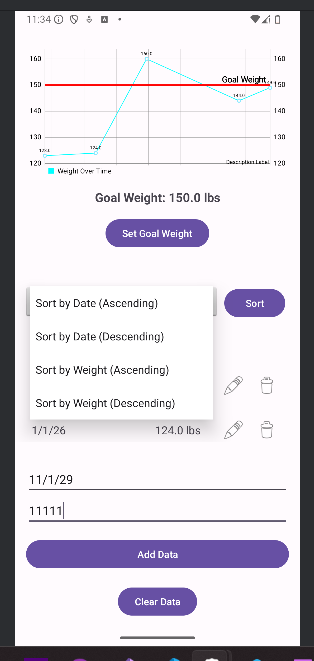

# Nuoro Weight Management App

## Overview
The **Nuoro Weight Management App** is an Android-based mobile application designed to help users track their weight, set goals, and analyze progress through data visualization. Originally developed in **CS-360: Mobile Architect & Programming**, it has been enhanced as part of **CS-499: Computer Science Capstone**, focusing on **Software Engineering & Design (Enhancement One)** and **Algorithms & Data Structures (Enhancement Two)**.

---

## Features

### **Original Implementation**
- Basic SQLite storage for weight logs.
- Static text-based weight entry display.
- Simple goal-setting functionality.
- No data validation, sorting, or filtering.
- Limited user interactivity and feedback.

---
## **Enhancement Two: Algorithms & Data Structures**
- **Sorting Options**:
  - Sort by **Date (Ascending/Descending)**.
  - Sort by **Weight (Ascending/Descending)**.
- **Search Functionality**:
  - Filter by **date range** and **weight range**.
- **Optimized Database Queries**:
  - Implemented `ORDER BY` for sorting and `WHERE` filters for searching.
- **Bug Fixes**:
  - Fixed chart disappearing issue when sorting descending.
  - Resolved RecyclerView scrolling issues.

---

## **Screenshots**

### **Sorting and Searching**
| Sort by Date (Ascending) | Sort by Date (Descending) |
|--------------------------|--------------------------|
|  |  |

| Sort by Weight (Ascending) | Sort by Weight (Descending) |
|----------------------------|----------------------------|
|  |  |

### **Other Key Features**
| Feature | Screenshot |
|---------|------------|
| Search & List |  |
| Input Validation |  |

---

## **Technical Implementation**
- **Database Enhancements**: Updated `DatabaseHelper` to support sorting and filtering queries.
- **Dynamic UI Updates**: RecyclerView dynamically refreshes based on sorting and search selections.
- **Graph Synchronization**: Ensured MPAndroidChart correctly updates when data changes.
- **Validation Logic**: Applied strict input checks for reliable user data.

---

## **How to Run**
1. Clone this repository.
2. Open in **Android Studio**.
3. Run on an emulator or physical device.

---

## **Acknowledgments**
Developed as part of **CS-360 & CS-499 at SNHU**. Special thanks to course instructors for guidance.
